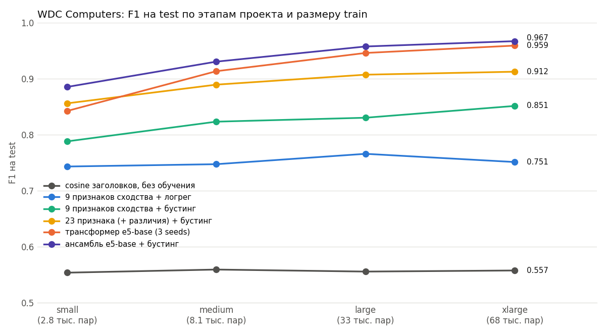
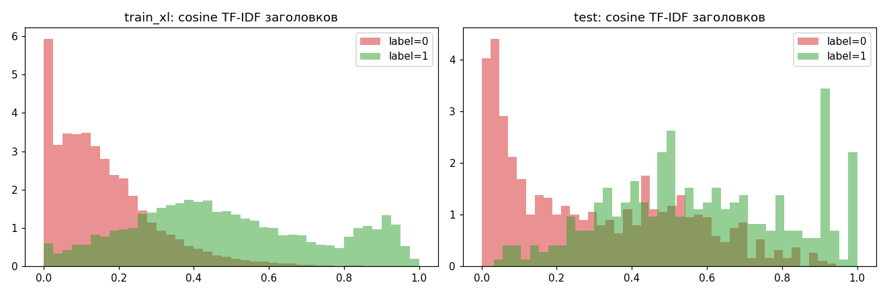
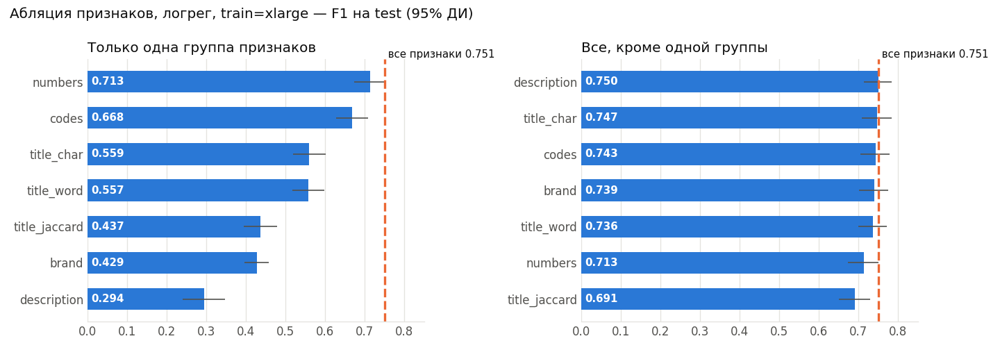
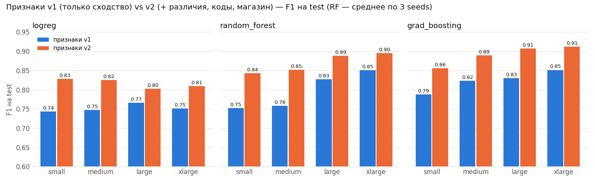
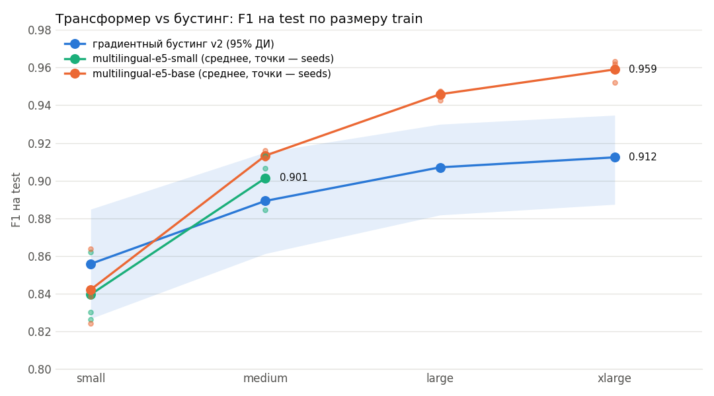

# Product Matching: дубль или нет

Определяем, описывают ли два товарных оффера с разных сайтов **один и тот же товар**. Датасет — [WDC Product Corpus v2](http://webdatacommons.org/largescaleproductcorpus/v2/index.html), категория Computers.

Путь от простого к сложному: TF-IDF-бейзлайн → признаки сходства и различий + градиентный бустинг → трансформер-кросс-энкодер → ансамбль.

## Результат

F1 на test (1 100 пар, 300 дублей), в зависимости от размера обучающей выборки:

| модель | small (2.8 тыс.) | xlarge (68 тыс.) |
|---|---|---|
| cosine TF-IDF заголовков, без обучения | 0.554 | 0.557 |
| 23 признака сходства/различий + градиентный бустинг | 0.856 | 0.912 |
| кросс-энкодер multilingual-e5-base (3 seeds) | 0.842 ± 0.020 | 0.959 ± 0.006 |
| **ансамбль e5-base + бустинг** | **0.885** | **0.967** |



Итоговый отчёт с выводами — **[REPORT.md](REPORT.md)**.

## Ключевые графики

**1. Test сложнее train** (EDA). Среди не-дублей в test гораздо больше пар с почти одинаковыми заголовками. Поэтому простая похожесть текста не работает, а валидация из train завышает качество.



**2. Какие признаки важны** (классика, серия 1). Абляция на логреге, train = xlarge: одни только совпадения чисел в заголовках (объём, частота, модель) дают почти столько же, сколько все признаки. Описание и бренд почти бесполезны.



**3. Признаки различий** (классика, серия 2). Добавление признаков «чем пары отличаются» (конфликт объёмов, почти совпадающие коды, код одного оффера в тексте другого) дало от +4 до +9 п. F1 всем трём классификаторам на всех размерах train.



**4. Трансформер vs бустинг** (DL). На малых данных хорошие признаки не хуже трансформера, на больших трансформер выигрывает +4.7 п. Точки — отдельные seeds: на small разброс между запусками до 4 п.



## Документы

| файл | что внутри |
|---|---|
| [PLAN.md](PLAN.md) | постановка задачи, метрики, протокол сравнения моделей, этапы |
| [EDA.md](EDA.md) | этап 0: анализ данных |
| [REPORT_classic.md](REPORT_classic.md) | этапы 1–2: бейзлайны и классический ML (абляции, классификаторы, признаки различий) |
| [REPORT_dl.md](REPORT_dl.md) | этап 3: трансформеры, сравнение с бустингом, ансамбли, разбор ошибок |
| [REPORT.md](REPORT.md) | этап 4: итог |

## Структура кода

| файл | назначение |
|---|---|
| `common.py` | загрузка и чистка данных, фиксированный val-split, метрики, bootstrap-ДИ, парное сравнение моделей |
| `eda.py` | EDA: статистика и графики в `eda/` |
| `baseline.py` | этап 1: cosine-бейзлайн и логрег на 9 признаках |
| `experiments.py` | этап 2, серия 1: абляции признаков, классификаторы, чистка текста |
| `features_v2.py`, `experiments_v2.py` | этап 2, серия 2: признаки различий, абляция, подбор параметров бустинга |
| `dl.py` | этап 3: обучение кросс-энкодера (CUDA / MPS / CPU) |
| `kaggle_job.py` | запуск `dl.py` на Kaggle GPU и загрузка результатов |
| `compare_dl.py`, `report_dl.py` | сравнение трансформеров с бустингом, ансамбли, разбор ошибок |
| `final_report.py` | этап 4: сводная таблица и график |

Результаты: `results*.csv`, логи `report_*.log` и `logs/`, графики `report/`, предсказания на val/test `predictions/`, id валидационных пар `splits/`.

## Как воспроизвести

### 1. Окружение

Python 3.13:

```bash
python3 -m venv .venv && source .venv/bin/activate && pip install -r requirements.txt
```

### 2. Данные

Данные в репозитории не хранятся, скачиваются с сайта WDC (≈ 60 МБ):

```bash
curl -LO https://data.dws.informatik.uni-mannheim.de/largescaleproductcorpus/data/v2/trainsets/computers_train.zip && unzip computers_train.zip -d computers_train
```

```bash
curl -L https://data.dws.informatik.uni-mannheim.de/largescaleproductcorpus/data/v2/goldstandards/computers_gs.json.gz | gunzip > computers_gs.json
```

Должно получиться:

```
computers_gs.json
computers_train/computers_train_{small,medium,large,xlarge}.json.gz
```

### 3. Запуск

Val-сплиты лежат в `splits/` и используются всеми скриптами, поэтому цифры совпадут с отчётами.

| шаг | команда | время (Mac M4) |
|---|---|---|
| EDA | `python3 eda.py` | < 1 мин |
| бейзлайны | `python3 baseline.py` | ~1 мин |
| классика, серия 1 | `python3 experiments.py` | несколько минут |
| классика, серия 2 | `python3 experiments_v2.py` | ~8 мин |
| трансформер, один прогон | `python3 dl.py --size small --model intfloat/multilingual-e5-base --lr 3e-5 --seed 0` | ~10 мин на small |
| сравнение и сводка | `python3 compare_dl.py && python3 report_dl.py && python3 final_report.py` | ~2 мин |

У `experiments.py` и `experiments_v2.py` есть флаг `--plots`: перерисовать графики из готовых CSV без пересчёта.

## Данные и цитирование

Ralph Peeters, Anna Primpeli, Christian Bizer. *WDC Product Data Corpus and Gold Standard for Large-Scale Product Matching*, version 2.0, 2019. Web Data Commons, University of Mannheim. http://webdatacommons.org/largescaleproductcorpus/v2/
