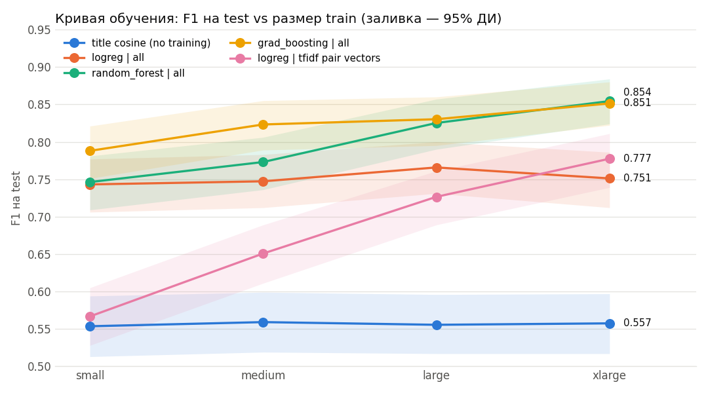

# Отчёт: классический ML на WDC Computers

Скрипт: `python3 experiments.py` (несколько минут; `--plots` — только перерисовать графики). Все цифры — `results_experiments.csv`, полный лог — `report_experiments.log`, графики — `report/`.

## TL;DR

| | F1 test (xlarge) | 95% ДИ |
|---|---|---|
| cosine TF-IDF заголовков, без обучения | 0.557 | [0.52, 0.60] |
| 9 признаков похожести + логрег (эталон) | 0.751 | [0.71, 0.79] |
| те же признаки + **RandomForest** | **0.854** | [0.82, 0.88] |
| те же признаки + **градиентный бустинг** | **0.851** | [0.82, 0.88] |

1. **Главный выигрыш — нелинейный классификатор**: бустинг/лес дают **+10 п. F1** к логрегу на xlarge (значимо, p < 0.001). Логрег упирается в потолок ~0.75 и не растёт с данными, деревья растут: 0.79 → 0.85.
2. **Самые полезные признаки** — пересечение **чисел** (объём, частота, модель) и **кодов моделей**. Одни только числа дают 0.71 — почти как все признаки. Описание и бренд почти не помогают.
3. **Агрессивная чистка текста вредит** (−3…−5 п.): удаление хвостов с названием магазина выкидывает полезный сигнал. Оставили «лёгкую» чистку.
4. **Ошибки** — трудные негативы (соседние модели одной линейки: 8 vs 10 TB, 007qux vs 006qux) и позитивы, где один оффер описан только кодом.

## 1. Постановка эксперимента

- **Train/val:** из каждого `train_{size}` фиксированно вырезано 20 % в val (стратифицированно, seed 42, id в `splits/`). Порог классификатора подбирается по F1 на val и применяется к test как есть.
- **Test:** `computers_gs.json`, 1 100 пар (300 дублей). Для выбора конфигурации не использовался.
- **Метрики:** F1 положительного класса (основная), P, R, PR-AUC. 95% ДИ для F1 — bootstrap по парам test (1 000 ресэмплов).
- **Сравнение с эталоном** (`logreg | all`): ΔF1 с 95% ДИ по paired bootstrap и p-value теста Макнемара. **Улучшение считается реальным, если ДИ ΔF1 не содержит 0.**
- **Признаки пары** (9 штук в 7 группах):

| группа | признаки |
|---|---|
| title_word | cosine TF-IDF заголовков (слова, 1–2-граммы) |
| title_char | cosine TF-IDF заголовков (символьные 2–5-граммы) |
| title_jaccard | Jaccard по словам заголовков |
| description | cosine TF-IDF описаний + флаг «описание отсутствует» |
| codes | Jaccard по кодам моделей (токены с буквами и цифрами) + флаг «коды есть, но ни один не совпал» |
| numbers | Jaccard по числам в заголовках |
| brand | бренды совпадают |

## 2. Сводная таблица: F1 на test

| Раздел | Конфигурация | small | medium | large | xlarge |
|---|---|---|---|---|---|
| 0 | title cosine, без обучения | 0.554 | 0.559 | 0.556 | 0.557 |
| A | **logreg, все признаки (эталон)** | 0.743 | 0.747 | 0.766 | 0.751 |
| B | random forest, все признаки | 0.746 | 0.773 | 0.825 | **0.854** |
| B | градиентный бустинг, все признаки | **0.788** | **0.823** | 0.830 | 0.851 |
| C | logreg, без чистки | 0.760 | 0.748 | 0.783 | 0.789 |
| C | бустинг, без чистки | 0.765 | 0.815 | **0.844** | 0.840 |
| C | logreg, полная чистка (с хвостами) | 0.709 | 0.714 | 0.720 | 0.727 |
| C | бустинг, полная чистка | 0.745 | 0.789 | 0.802 | 0.808 |
| D | logreg на TF-IDF векторах пары | 0.567 | 0.651 | 0.726 | 0.777 |

## 3. Раздел A — абляция признаков (логрег)

F1 на test, логрег:

| группа | только она: small / xlarge | все, кроме неё: small / xlarge | ΔF1 без неё, xlarge [95% ДИ] |
|---|---|---|---|
| numbers | 0.718 / 0.713 | 0.716 / 0.713 | **−0.038** [−0.060, −0.016] |
| codes | 0.655 / 0.668 | 0.748 / 0.743 | −0.008 [−0.024, 0.009] |
| title_char | 0.577 / 0.559 | 0.719 / 0.747 | −0.004 [−0.022, 0.015] |
| title_word | 0.554 / 0.557 | 0.744 / 0.736 | −0.015 [−0.033, 0.004] |
| title_jaccard | 0.481 / 0.437 | 0.678 / 0.691 | **−0.060** [−0.083, −0.037] |
| brand | 0.429 / 0.429 | 0.728 / 0.739 | −0.012 [−0.025, 0.002] |
| description | 0.500 / 0.294 | 0.698 / 0.750 | −0.001 [−0.009, 0.008] |

Выводы:
- **Числа — самая сильная группа.** В одиночку дают 0.71 (все признаки — 0.75), и без них качество значимо падает. Логично: трудные негативы отличаются именно числами (32gb/128gb, 1950x/1900x).
- **Коды моделей сильны в одиночку (0.67), но в полном наборе избыточны**: их информация во многом дублирует числа (коды содержат цифры).
- **title_jaccard слаб в одиночку, но незаменим в комбинации** (−6 п. без него). Он дополняет TF-IDF-cosine: не взвешивает слова по частоте, а считает «сколько слов разные» — редкий, но отличающийся токен здесь заметнее.
- **Описание почти бесполезно** на больших данных (на small помогает, −4.5 п. без него). На xlarge «только описание» даже ломается: порог, подобранный на val, не переносится на test (F1 0.29 при R = 0.21), т.к. в test описания заполнены намного чаще, чем в train (93 % vs 69 %).
- **Бренд** в одиночку бесполезен (модель помечает всё как дубль: R = 1.0, P = 0.27), в комбинации даёт ~1 п. — на грани значимости.
- Словные и символьные TF-IDF-cosine взаимозаменяемы: удаление любого из них почти не меняет F1.

## 4. Раздел B — классификаторы

| xlarge | F1 | P | R | PR-AUC | ΔF1 vs эталон [95% ДИ] | McNemar p |
|---|---|---|---|---|---|---|
| logreg | 0.751 | 0.667 | 0.860 | 0.848 | — | — |
| random forest | 0.854 | 0.813 | 0.900 | 0.923 | **+0.103** [+0.078, +0.131] | <0.001 |
| градиентный бустинг | 0.851 | 0.810 | 0.897 | 0.915 | **+0.100** [+0.074, +0.128] | <0.001 |

- Деревья выигрывают **за счёт precision** (0.67 → 0.81): они умеют правила вида «cosine высокий, НО числа не совпадают → не дубль», которые линейная модель выразить не может.
- **Бустинг лучше на малых данных** (small: 0.788 vs 0.746 у леса), на large/xlarge лес и бустинг неразличимы (ДИ перекрываются почти полностью).
- **Логрег не растёт с данными** (0.74 → 0.75): 9 признаков и линейная граница — модели нечему больше учиться. Деревья растут на ~6–10 п. от small к xlarge.

## 5. Раздел C — чистка текста

Три режима: `none` — только lowercase; `light` — убираем `"..."@en` и `null` (**по умолчанию**); `full` — + удаляем хвосты с названием магазина (`| OcUK`, `▷ …`, `cdw.com`).

| | small | medium | large | xlarge |
|---|---|---|---|---|
| logreg: none / light / full | 0.760 / 0.743 / 0.709 | 0.748 / 0.747 / 0.714 | 0.783 / 0.766 / 0.720 | 0.789 / 0.751 / 0.727 |
| бустинг: none / light / full | 0.765 / 0.788 / 0.745 | 0.815 / 0.823 / 0.789 | 0.844 / 0.830 / 0.802 | 0.840 / 0.851 / 0.808 |

- **`full` стабильно хуже** (−3…−5 п.). Диагностика по частям регулярки показала: вредит именно обрезка текста после `|` и `▷`. Она удаляет название магазина, а оно информативно — **пары с одного магазина почти никогда не дубли**: в test 22.5 % пар с одного сайта, среди них дублей 7 % (при 27 % в среднем). Сайт обычно публикует товар один раз.
- **`none` vs `light`** — для бустинга разница в пределах шума; для логрега `none` не хуже, а иногда лучше (от 0 до +3.8 п.). Вероятно, по той же причине: в сыром тексте больше «следов» источника (`@en-US`, кавычки и т.п.).
- ⚠️ Сигнал «один магазин → не дубль» частично **артефакт построения датасета** (в test много таких трудных негативов). В реальной дедупликации между сайтами он тоже работает, но полагаться на него надо осознанно. Следующий шаг — сделать его явным признаком `same_shop`, а не надеяться, что модель поймает его через токены.

## 6. Раздел D — TF-IDF векторы пары (`|a−b|`, `a*b`)

- Сильнее всех **растёт с данными**: 0.57 → 0.65 → 0.73 → 0.78, но даже на xlarge хуже деревьев на 8 п.
- **Переобучается на знакомые товары**: на val (из того же распределения, где те же офферы) у неё лучший F1 среди всех на xlarge — 0.853, а на test только 0.777. Модель запоминает конкретные токены конкретных товаров, а не учится сравнивать.
- Поэтому «лучшая по val» модель на xlarge — именно она, хотя на test лучше деревья. **Вывод для протокола:** выбирать между подходами разной природы по одному val F1 опасно; у нас val в целом хорошо ранжирует конфигурации (Spearman ρ = 0.97 между val F1 и test F1 на xlarge), но у моделей-«запоминателей» val завышен.

## 7. Порог

F1 на test при пороге, подобранном на val, стандартном 0.5 и «оракульском» (лучший на самом test, **только для анализа**):

| xlarge | порог (val) | F1 (val-порог) | F1 (0.5) | F1 (оракул) |
|---|---|---|---|---|
| logreg | 0.31 | 0.751 | 0.766 | 0.767 |
| random forest | 0.39 | 0.854 | 0.847 | 0.855 |
| бустинг | 0.35 | 0.851 | 0.838 | 0.854 |

- Для деревьев подбор порога на val работает: отставание от оракула ≤ 0.3 п.
- Для логрега val-порог систематически **ниже оптимального** (на medium 0.747 vs 0.789 оракул): val содержит меньше трудных негативов, чем test, и модель там «можно» делать щедрее. Это то самое смещение train→test из EDA.

## 8. Разбор ошибок

Лучшая модель на test (random forest, xlarge): F1 0.854, P 0.81, R 0.90 — это 62 FP и 30 FN из 1 100 пар. Подробные примеры в логе приведены для модели, выбранной по val (pair vectors, FP 90 / FN 52); типы ошибок у всех моделей одинаковые.

**Ложные срабатывания (FP) — соседние модели одной линейки:**
- отличается одна цифра в коде: `70dg007qux` vs `70dg006qux`, `hx426c15fb` vs `hx424c15fb`;
- отличается объём/ёмкость: `ironwolf pro 10tb` vs `8tb`, `64go` vs `8go`;
- отличается подмодель: `thinkpad 11e` vs `thinkpad yoga 11e`, `threadripper 1950x` vs `1900x`.

В 97 % FP числа в заголовках различаются, в 58 % при этом есть общий код модели (например, общий код линейки). Признак «числа различаются» у нас есть только в виде Jaccard — модель не отличает «разный объём» от «лишнее число в хвосте».

**Пропуски (FN) — один товар описан очень по-разному:**
- один оффер — только код: `asus ex-gtx1050-2g` vs полное название, `corsair cmk16gx4m2a2400c14` vs длинный заголовок;
- разные языки и синонимы: `64go` (фр.) vs `64gb`, `1 to` vs `1tb`;
- код модели разбит по-разному: `cmk16gx4m4a24…` обрезан в одном заголовке.

## 9. Выводы и что делать дальше

**Лучшая классическая конфигурация:** 9 признаков похожести + RandomForest / градиентный бустинг, лёгкая чистка → **F1 ≈ 0.85** на xlarge (0.79 на small).

Следующие шаги для классики (этап 2, продолжение):
1. **Признаки различий, а не только сходства**: «есть число, которого нет у другого», разница объёмов/ёмкостей (с нормализацией `tb/gb/go/to`), совпадение/различие «главного» кода, длина общего префикса кода.
2. **Явный признак `same_shop`** (с оговоркой из раздела 5).
3. Нормализация единиц и синонимов: `go→gb`, `to→tb`, `x4→4x`.
4. Подбор гиперпараметров бустинга (сейчас дефолты) — на val, с проверкой через paired bootstrap.

Переход к DL (этап 3) логичен уже сейчас: трансформер-кросс-энкодер видит токены обоих офферов одновременно и должен сам учиться «цифра отличается → не дубль», а также понимать синонимы и языки — ровно те классы ошибок, на которых застревают признаки.

## Ограничения

- Одна фиксированная val-разбивка и один seed для леса/бустинга; для итоговых сравнений нужно 3–5 seeds.
- Метрика «F1 на трудном подмножестве val» (`val_hard_F1`) шумная и зависит от того, как определены «трудные» пары (через TF-IDF-cosine) — коррелирует с test слабее (ρ = 0.61), чем обычный val F1. В выводах не используется.
- Все выводы о значимости — на одном test из 1 100 пар; разница < 2–3 п. F1 обычно неразличима.
